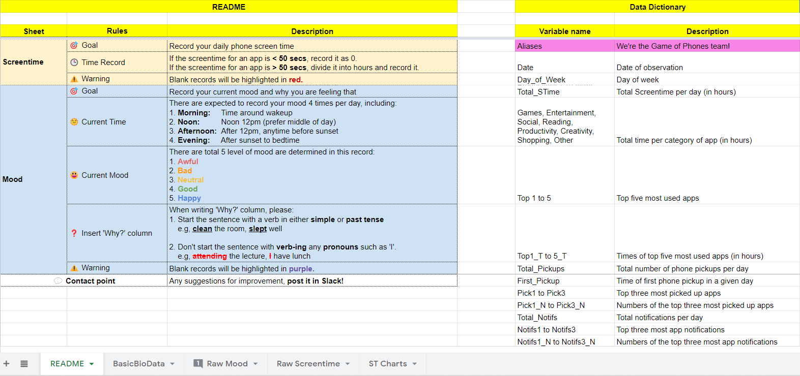
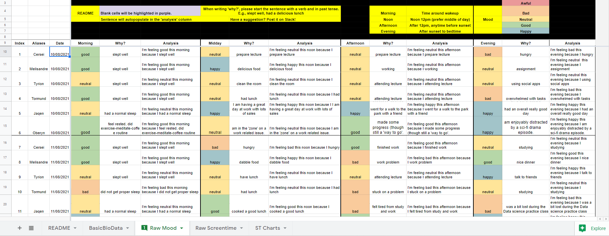
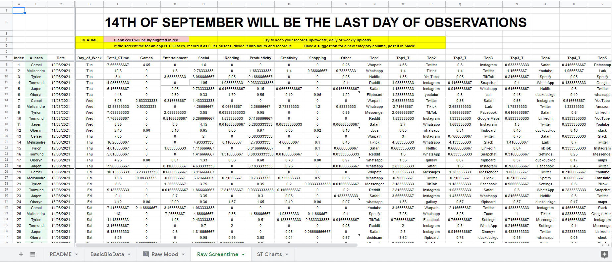
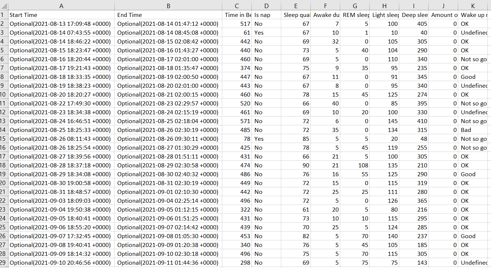

```{r include = F}
setwd("C:/Users/LEAH NGUYEN/OneDrive/Desktop/GitHub/self-quantified-data-analysis")
```

# Introduction
The goal of quantified self-tracking is to monitor and track human-related data such as biological, physical, behavioral, or environmental data (Swan, 2009). “Self-knowledge through numbers” (Ruckenstein, 2015; Schüll, 2016; Swan, 2012) and “self-optimization” (Ruckenstein, 2015; Schüll, 2016; Swan, 2012) are two principles that frequently coexist with quantified self-tracking (Choe et al., 2014:1147;). 

There could be an infinite number of things to measure, but QS focuses on gaining useful insights from QS data and using that information to change and improve human behavior. With this in mind, we designed our quantified self-experiment project as a group of three to investigate general ideas, knowledge, tools, approaches, and experiences.

To thoroughly investigate and comprehend QS, a range of regions as Individuals, Small Groups, and a Large Cohort data set were tracked and analyzed in this experiment to further investigate the following questions:

- **What did you do?** We look at how a variety of circumstances affect how people's emotions and behaviors change.
- **How did you do?**  How might tracking tool limitations or member poor practices effect data quality issues in quantified self-tracking?
- **What did you discover?** It is possible to gain insights into one's own life by analyzing the relationships in data.

As an additional section, a few discussions about data privacy and ethics are presented. It is critical to define privacy criteria for how personal data is used in all QS research, particularly those involving sensitive personal information about group members.

# The Rationale

The question we seek to answer in this study is how digital screen time affects mood, and if there is any relationship between these two factors with the sleep quality. In terms of group data, the overall goal of our team was to gather and then exchange data measurements about ourselves over a five-week period of time (10th August - 14th September) in order to evaluate the association between mood and time on screen. Based on popular media stories (Alltucker, 2019), our group hypothesized that digital addiction can have a negative impact on mood. In addition, we also look further into the comparison between our group screentime behavior with the average Aussie screentime to evaluate the frequency of mobile usage of our team members. 

On the other hand, in terms of reviewing individual data analysis, I look into the relationship between sleep quality, sleep duration and the group data to uncover the impact of the my daily behavior on the physical health and personal emotions. Furthermore, the data is collected in this project will be used on an educational level so that data science students in the MDSI course can critically examine the data quality, privacy, and ethics issues that occur when collecting data.

# Data Collection

## 1. The Data

In this project, we approach a range of variables, from physical activities to psychological to social and environmental components, using a design for comprehending multifacets of quantified-self tracking. Table 1 summarizes the amount of datasets in this project as well as the measures and methods utilized to measure, transform, and track personal data in this report.

|**Type**|**Dataset**|**Measures**|**Collected through**|
| :- | :- | :- | :- |
|**Group**|Screen Time|Daily usage of phone applications and screentime|Smart phone application (app)|
|**Group**|Mood|Daily mood status|Manually record|
|**Indivdual**|Sleep|Sleep duration|Smart phone application (app)|
|**Large Cohort**|Average Aussie Screentime|Hours on average Aussie spend looking at their phones per day |Online Article (Dixon, 2021)|

<center>
**Table 1.** Dataset Collection and Method
</center>

## 2. The Collection Methods

Methods for collecting data from small groups were decided upon at the beginning of the study and refined as needed throughout the project. Choices of group data was informed by brainstorming both in group online meeting via Zoom and private group messaging channel on Slack. Mobile screentime data and mood of each member was decided to be used for structured and unstructured data and sleep data was selected for self analysis in terms of individual level data. For comparison, publicly available average Aussie screentime (Dixon, 2021) was used as a standard scale to assessing the frequency of team member's mobile phone usage pattern. Each of the three datasets has its own unique collection process, which is explained as following:

### a. Screen Time Data

Structured data collected was chosen to be total and categorised daily mobile screentime. This data was chosen because it was available and accessible to all members through built-in or third-party monitoring apps. Particularly, categorised screentime was hypothesized to be representational of individual daily lifestyles and potentially members' personal interests such as people who use sports apps on a regular basis have healthier lifestyles and are more concerned about their well-being (Carroll et. al, 2017).

Each of our six participants was asked to log their daily minutes of screen time using a mobile phone program (app) or default phone operating system of their choice, primarily Android's StayFree app and the inbuilt Apple IOS screen tracker for iPhones. Data about phone screen usage, including apps, notifications, and pickups, is collected in a variety of ways, including date and time, length, number or frequency, and app name (Appendix 2-2).


### b. Mood Data

As for unstructured data, mood data was chosen due to the association between the increasing time on screen with other elevated risk of depressive symptoms, according to a recent study (Rosenthal, 2021). 

The participant's state of mind/feeling was recorded at a given time of day to see if it was influenced by factors such as phone usage or sleep quality. The mood state was recorded using a likert scale with the range: 

* 1- Awful 
* 2 – Bad 
* 3 – Neutral 
* 4 – Good 
* 5 – Happy

and a corresponding free-text box that demands a brief description of the ‘Why' of the mood status (Appendix 2-1).

### c. Sleep Data

Sleep data selected as invidual data with the aim of discovering the correlations between daily activities, specifically smartphone usage with sleep quality, and sleep quality impact on personal emotion. For this analysis, I have chosen data collected from smart phone application called Pillow. The data consists of various variables such as Sleep Start Time, Sleep End Time, Sleep Duration, Sleep Quality, Sleep Cycles, etc. Each row corresponds to a single day and the data is collected over the period of 5 week (Appendix 2-3).

## 3. Storage of Data and Group Access to Shared Data

Google Drive was used for all shared information and each team member uploaded the data they had collected. The datasets were small enough to be uploaded onto individual “Google Sheets” as Excel documents, without any problems. The data was then combined into one Excel workbook, with one spreadsheet per dataset containing the combined data for all team members (Appendix 2-1, 2-2) and another for assessing group rules and data description (Appendix 1).

## 4. Anonymisation of Datasets

The anonymization of group level data sets was critical to our group in order to protect the privacy of everyone's personal data. The anonymity of users helps retain the personal identity, their psychological behaviour, the places they have been to, and their comments on the mood survey protected within the group as well as from other people who have access to the data and this analysis. As a result, the possibility of misusing this data and revealing user information is eliminated.

The group leader provided each member an alias based on Game of Thrones characters such as Cersei, Melisandre, Tyrion, Oberyn, Tormund, and Jaqen in order to anonymize the data sets. As a result, when each person updated their record in the Google Spreadsheet, they were de-identified from the data, and everyone could see if all six members had submitted their records.

In addition, doing so would not identify specific users or the most frequently used apps by them in this analysis. Because screen time includes access to all phone functionalities, there is a global risk of data breaching; nevertheless, in this specific investigation, masking user identity aids in protecting user information and actions.

# Data Quality

Appendix 3 shows the missing observations from three datasets: screentime (Appendix 3-1), mood (Appendix 3-2), and sleep (Appendix 3-3). As can be observed from these figures, there are no missing values in our group as well individual datasets. However, there are other concerns during the data gathering process which were a greater issue with data quality than we had anticipated as following:

## 1. Screen Time Data

For the screen time data, many background apps were observed with a high value of screen time in seconds, therefore that was adjusted. Because of their unusually high value, these numbers are considered outliers.

## 2. Mood Data

It was originally meant to track our mood four times a day, at waking, lunch, dinner, and bedtime. In practice, however, this proved difficult to maintain. Furthermore, there is no timestamp synchronization between each user's data records. It should also be noted that the mood variable's value is subjective, therefore each person has a different scale.

Another point that worth mentioning is due to the high frequency of recording (3 times per day) and the subjective characteristics of this data type, the mood record can be bias when the person cannot be able to update their mood instantly but wait after a while due to busy working and studying schedule. This can considered as the limitation of the data type itself and the collection method using manual entries.

## 3. Sleep Data

Despite the fact that there are no missing values from table columns, I discovered that there are occasional missing date records owing to technological issues such as phone crashes or automated IOS version updates, which was unexpected. Furthermore, because the CSV is generated by the Pillow app, the format of some of the column names is difficult to interpret and log in the R software while performing analysis.

# Analysis & Findings

The analysis of the personally collected data and group level data was done using the RStudio software.

## 1. Screen Time Analysis

Figure 1 shows the amount of time each team member spent on the screen during the five-week period. It is evident from the graph that smartphone use fluctuated over the course of the project but eventually declined for all participants. Melisandre had the most total screen time, while Oberyn had the lowest number total mobile on screen appearances overall.

{width=700px}

<center>
**Figure 1.** Daily screen time by participant
</center>


Figure 2 provides a better understanding in terms of assessing the mobile phone behavior between large cohort group and our small group. A mean of 7.0 hours was calculated as the standard large cohort scale for our group's mobile phone usage based on the average daily screen time of Aussie Millennials and Gen Z (Dixon, 2021). 4 out of 6 members, namely Cersei, Jaqen, Melisandre, and Tyrion, use their mobile phones in excess compared to the average screen time of Australians, while Oberyn and Tormund's total screen time were below the average standard of smartphone screen time.


{width=700px}

<center>
**Figure 2.** Average screen time by participants against large cohort
</center> 

Figure 3 depicts the total amount of time spent using various Social apps. The frequency of use can be seen to be evenly distributed and high across the majority of the group members. The time spent on social media applications does tend to decrease after 5 weeks of observation, however. The increased workload and study time of the MDSI program may be to held responsible as the participants in this study tend to use social media less frequently over time to devote to studying.

{width=700px}

<center>
**Figure 3.** Screen Time spent on Social category
</center> 

Figure 4 shows the total amount of time spent on apps in the category of Creativity. As a group of six, Melisandre is the one who spends the most time using applications in this category, while the other members spend a relatively small amount of time.

{width=700px}


<center>
**Figure 4.** Screen Time spent on Creativity category
</center> 

According to Figure 5, apps in the Entertainment/games category accounted for the majority of the time spent on smartphones and tablets. Use of entertainment apps and social applications is quite similar, as shown in the graph, which demonstrates a fairly even distribution of usage and a disproportionately high level of use among all members. Melisandre, on the other hand, uses entertainment apps more frequently than most people, which goes against the overall trend of the group.

{width=700px}

<center>
**Figure 5.** Screen Time spent on Games/Entertainment category
</center> 

Figure 6 depicts the total amount of time spent on the Reading apps. All members used these apps very seldom, with Tormund using the most reading-related apps. Melisandre and Oberyn are close behind, with a decreasing trend over time.

{width=700px}
<center>
**Figure 6.** Screen Time spent on Reading category
</center> 

Figure 7 depicts the total amount of time spent on apps in the Shopping category. Tyrion and Melisandre, in particular, are much more frequently used than the rest of the members. There is no discernible upward or downward trend in application usage in this category, as it is frequently unpredictable and highly fluctuating over time.

{width=700px}
<center>
**Figure 7.** Screen Time spent on Shopping category
</center> 

According to Figure 8, productivity applications are used frequently in Oberyn and Melisandre, with a decreasing and stable trend over time, respectively. Meanwhile, the other members' usage statistics are quite low.

{width=700px}

<center>
**Figure 8.** Screen Time spent on Productivity category
</center> 

When comparing weekday and weekend phone usage trends, there is little difference in behavior and total screen time for category apps, with Social and Entertainment apps being the most popular. This demonstrates that my team members are fairly consistent in their use of phone applications. The fact of having more time spare time on weekends is reflected by a significant increment on categories such as Games/Entertainment and Reading.
{width=700px}
<center>
**Figure 9.** Screen Time During Weekday vs Weekend
</center> 

## 2. Mood Analysis

In order to conduct the NLP analysis for mood dataset, I divided the initial 5 emotional scale into three categories to facilitate analysis: Positive, Neutral, and Negative emotions. To accomplish this, I designated 'Happy' and 'Good' as positive emotions, 'Bad' and 'Awful' as negative emotions, and 'Neutral' as unchanged.

To discover the association between the keywords/events with the emotions, I used word analysis using word clouds visualization as illustrated in Figure 10 and Figure 11. Notably, data for the 'Neutral' emotion scale were omitted because they added little value to this analysis.

In relations with positive emotions, terms like "good", "sleep", "friend" appeared frequently across dataset (Figure 10). This demonstrates that when members are relaxing, resting, or spending time with close friends and family, their emotions are more likely to be positive.

{width=700px}
<center>
**Figure 10.** Words associations with positive feeling
</center> 

When referring to the group of negative emotions, however, the keywords "work,""tired," and "assignment" appear frequently (Figure 11). This hypothesis is supported by the discovery of a link between high workload and depressive disorders (Woo, 2008).

{width=700px}
<center>
**Figure 11.** Words associations with negative feeling
</center> 

## 3. Sleep Analysis

Figure 12 depicts the trend in my total sleep time and sleep quality over time, as well as the relationship between the two. It can be seen that as time went on, I slept fewer and fewer hours, and the quality of my sleep deteriorated. This could explain why the further I got into the MDSI semester, the less sleep I got, which left me with less time to spend on homework and studying in the night time.

{width=700px}
<center>
**Figure 12.** Sleep Duration Overtime
</center>

Sleep stages analysis is another important factor to be considered when assessing the sleep quality. As presented in Appendix 4, 3 sleep cycles including Light Sleep, Deep Sleep and REM Sleep plays a vital role in the development of a good sleep. In my case, it can be seen that I have a quite healthy sleeping schedule as total Deep Sleep is high with other variables are fairly consistent. In terms of analyzing the different sleep stages duration throughout the week, there is no significant difference between sleep stages. The total sleep duration in all stages are increasing toward the end of week and have a decreasing trend during mid weekdays.

{width=700px}
<center>
**Figure 13.** Sleep Stages Duration by Day of Week
</center>

In terms of assessing the relationship between sleep data with other variables such as mood and smartphone usage behavior, it can be seen that there is a positive correlations between total screen time and sleep quality. This means that the more I use smartphone, the better sleep I have. On the other hand, when assessing the relationship between sleep quality, sleep duration with mood, the graph shows 2 unexpected findings: as my mood improve, my sleep quality is better, however, the better I feel, the less sleep I get.

As the sleep quality and sleep duration are highly correlated, this trends in relation with mood dataset provide bias result as needed for further investigation. Therefore, it can be implied that there is no direct relationship between my mood and the sleep quality/duration.

{width=700px}

<center>
**Figure 14.** Relationship of Sleep Quality with other factors
</center>


# Findings

Exploration of mobile, social, and physical activity via metrics obtained via personal mobile devices yielded a plethora of group insights, including mine. It was discovered that there were varying patterns of use within the group when total mobile screentime was studied. Some members, including myself, showed a greater use of mobile devices earlier in the semester, which was found to be consistent with the primary use of mobile activities for entertainment screen time. 

Notably, in reflection of my own observation, this hypothesis is reconfirmed as I possess an excessively screen time usage in comparison with the large cohort data average Aussie screen time. However, with categorized screen time, I have relatively consistent usage habit with the group in Social, Entertainment, Reading, Productivity and slightly higher in Shopping. Taking into account these findings, it was suprised to me that my behaviour toward shopping has shifted to online rather than offline like before. This could be explained as the Lockdown effect, which make me to be more reliant on online shopping apps.

On the other hand, mood status across members appears to improved while performing leisure activities such as resting, socializing while work-related activities seems to reduce the mood. 

Another interesting finding is there is a positive correlations between my sleep quality with mood and mobile phone usage. However, a further investigation needs to be assessed to evaluate as there is no direct explanations for the contrast trend toward the sleep duration.

# Discussion

## 1. Privacy

Due to the variety of mobile phone operating systems, we allowed each user to choose their own mobile app that would collect this data over time. This did raise some concerns, not just since the mechanism for calculating screen time varies every app, but also because we were not evaluating the app's security and stability. This could result in the app acquiring a large amount of personal data, possibly far more than what is required for its basic activities, and passing it on to or selling it to unknown third parties.

It is frequently stated in reference to social media and other technology firms that if the product is free, you are the product (Oremus, 2018), and in this situation, our users and their data were most certainly utilised to assist in monetising the free screen time tracking apps. There is a large market in the buying and selling of user data and trying to create holistic maps of user attributes from online and offline activity to better serve advertising to them and optimize user activity (Melendez & Pasternak 2019).

However, the data we make available to researchers is anonymized and contains only the date and daily screen time minutes. Perhaps one might examine weekly patterns and determine whether they connect with gender, age, or career, but this is not clear to us, nor is it clear that one could re-identify an individual based on that information.

## 2. Legal and Policy Concerns

Due to the group's use of UTS, the UTS Acceptable Use of Information Technology Facilities policies apply to all uses of the collected data. Ethical, socially responsible, legal, academic, and professional standards of conduct, as well as competent and efficient use, all had a significant impact on how tasks for this report were completed, particularly in relation to the group data collected (UTS, 2001). Prior to extracting selected datasets from my group members' files, care was taken to understand the folder structure and content of my own Instagram file. Any unused data was then deleted from my device; however, the files were retained on Google Drive to ensure that other members could access them. Unnecessary data was removed to avoid gaining access to potentially sensitive data belonging to others and to select data that would pose the fewest difficulties for analysis and inference in terms of privacy and confidentiality concerns. 

Additionally, federal and state privacy legislation, such as the Privacy Act 1988 (ICLG, 2020), the NSW Privacy and Personal Information Protection Act 11, as well as regulation governing the potential harms associated with data use (e.g., anti-discrimination, copyright, and intellectual property rights), shaped data use in this task. The latter is especially pertinent to the Instagram data, as social media platforms thrive on connecting people with shared interests, encouraging the sharing of a diverse range of personal data within private social networks or even publicly. Many of these categories of information are frequently targeted by malicious entities or individuals with malice in their hearts: religious beliefs, age, race, disability, sexual orientation, unique designs, or private proclivities. Female LGBTQ+ individuals are frequently socially marginalized and face greater levels of prejudice and microaggressions than their male counterparts (Zurbrugg et al., 2016).


## 3. Data Ethics

Data ethics is characterized as an action-oriented analytical framework or proactive agenda that could strive to balance powers entrenched in the Big Data Society and drive toward human-centric power distribution (Gry, 2019). Simply defined, it is about making data responsible and sustainable for people and society. It necessitates a comprehensive approach that encompasses concepts and norms in data processing activities (GOV.UK, 2019). Five components of the data ethics principles proposed by (Pernille, 2018) will be piped through our experiment to assess its ethical standards.

- **The human being at the center:** Our experiment is intended to provide key benefits to our group members, as mentioned explicitly in our purpose, which is to investigate and understand members' insights through QS experiment.

- **Individual data control:** All data were captured individually and verbally committed to use within the boundaries of the assignment.

- **Transparency:** All members are aware of the danger and its societal implications. It is merely a two-month initiative, and all members are students, with the major activity centered on learning, so there should be no high danger or ethical implications. However, de-identification and the use of less sensitive data could reduce the risk to a bare minimum.

- **Accountability:** To decrease risks to individuals and alleviate social and ethical repercussions, sustainable personal data processing, such as data anonymisation, is considered.

- **Equality:** Because we are students at the same university, we assume we have the same societal power. It may lessen the possibility of discrimination or stigmatization in our judgment.

These concepts were particularly prevalent in the formulation of the investigated question, as well as the methods and data used to answer it. Despite these precautions, the principle of minimizing data intrusion was applied in a substandard manner in comparison to other ethical concerns. This was because confidentiality measures were applied inconsistently across the group and sources, undermining the effectiveness of the privacy plans in place. 

While the impact in this case is likely to be minimal, similar lapses in future data management could have serious consequences, particularly when dealing with larger datasets. This could include legal disciplinary action under the Privacy Act 1988 for questionable proportionality and data minimisation practices, as well as for facilitating the collection of large amounts of data through the use of an intentionally open research question and insufficient de-identification practices. 

The importance of proportionality and data minimisation management is self-evident in commercial data breaches: Ashley Madison's unethical behavior in failing to delete customer data upon request resulted in the leakage of highly sensitive personal and financial information (Thomsen, 2015). Additionally, disregard for these concerns in the absence of relevant frameworks such as the Ethical OS Checklist enables the development of larger scale sociopolitical problems associated with data monetisation, control, and surveillance states (Institute for the Future and Omidyar Network, 2018).

# Reflection

By incorporating data innovation for this quantified self project, this project advanced my understanding of the group's behaviors and interests, particularly in relation to myself. As a Z generation, examining data within and against group and cohort allowed me to have a more precise quantification of social, physical, and lifestyle behaviors through the lens of mobile usage. The amount of screen time findings confirm my high level of dependence on mobile devices, particularly in comparison to the group, for social and entertainment purposes, as opposed to fitness, education and other categories.

These findings indicate that I can improve my own lifestyle by reducing my mobile use, sedentary behavior, and reliance on my phone in order to improve my physical and mental health through improved sleep quality and emotional health outcomes.

Recommendations for future similar projects include more meticulous team discussions outlining de-identification strategies and outlining storage, recording, collaborative, and anonymization methods that work in concert to achieve data privacy.

Proportionality and data minimization were critical concerns not only for this task, but also for the broader practice of data science as a whole, given the widespread harm it can facilitate. This is especially true in the context of this research question, which necessitates the examination of personal data in order to gain insight into cohort, group, and individual social, physical, and lifestyle (as represented by screentime) activity patterns. Discoveries could be used to ascertain sensitive socio-cultural, health, and behavioral characteristics. When these issues are considered on a larger scale, it becomes clear that organizations must strengthen their data policies and codes of conduct, in addition to putting them into practice.


# References


1.	Alltucker, K. (2019). A Rise In Depression Among Teens And Young Adults Could Be Linked To Social Media Use. NPR. Retrieved from <https://choice.npr.org/index.html?origin=https://www.npr.org/transcripts/703170892> 
1.	Carroll J, Moorhead A, Bond R, LeBlanc W, Petrella R, Fiscella K (2017). Who Uses Mobile Phone Health Apps and Does Use Matter? A Secondary Data Analytics Approach. J Med Internet Res. 19(4):e125. DOI: 10.2196/jmir.5604
2.	Choe EK, Lee NB, Lee B, et al. (2014) Understanding Quantified-selfers’ Practices in Collecting and Exploring Personal Data. Proceedings of the 32nd annual ACM conference on Human factors in computing systems, New York, New York, USA: ACM Press: 1143–1152.
3.	GOV.UK. (2019). Data Ethics Framework. Retrieved from <https://www.gov.uk/government/publications/data-ethics-framework/data-ethics-framework> 
4.	Gry, H. (2019), Making sense of data ethics. The powers behind the data ethics debate in European policymaking, Volume 8, Issue 2 PUBLISHED ON: 13 Jun 2019 DOI: 10.14763/2019.2.1401, Department of Information Studies, University of Copenhagen, Denmark
5.	ICLG (2020). Data Protection Laws and Regulations. ICLG. Retrieved from <https://iclg.com/practice-areas/data-protection-laws-and-regulations/australia>
6.	Institute for the Future and Omidyar Network (2018). Ethical OS. IFTF. Retrived from <https://ethicalos.org/wp-content/uploads/2018/08/EthicalOS_Check-List_080618.pdf︎>
7.	Melendez, S & Pasternak, A (2019) Here are the data brokers quietly buying and selling your data. Fast Company. Retrieved from <https://www.fastcompany.com/90310803/here-are-the-data-brokers-quietly-buying-and-selling-your-personal-information> 
8.	Oremus, W (2018) “Are you really the product?” Slate. Retrieved from <https://slate.com/technology/2018/04/are-you-really-facebooks-product-the-history-of-a-dangerous-idea.html> 
9.	Pernille, T. & Gry H. & Birgitte K. Olsen & Catrine S. (2018) DATAETHICS – Principles and Guidelines for Companies, Authorities & Organisations, Isbn print: 9788771920475 Isbn pdf: 9788771920482 Isbn epub: 9788771920499, Retrieved from: <https://dataethics.eu/wp-content/uploads/Dataethics-uk.pdf> 
10.	Rosenthal, S. R. (2021, July 1). Association between mobile phone screen time and depressive symptoms among college students: A threshold effect. Wiley Online Library. https://onlinelibrary.wiley.com/doi/full/10.1002/hbe2.256
11.	Ruckenstein, M. (2015). Uncovering Everyday Rhythms and Patterns: Food Tracking and New Forms of Visibility and Temporality in Health Care. In: Botin; L, Pernille B, 36 Nøhr C (eds), Techno-Anthropology in Health Informatics: Methodologies for Improving Human-Technology Relations, pp. 28–40.
12.	Schüll ND (2016) Data For life: Wearable Technology and The Design Of Self-care. BioSocieties: 1–17.
13.	Swan, M. (2009). Emerging Patient-Driven Health Care Models: An Examination of Health Social Networks, Consumer Personalized Medicine and Quantified Self-Tracking. International Journal of Environmental Research and Public Health, 6(2), pp.492-525
14.	Swan, M. (2012). Health 2050: The Realization of Personalized Medicine through Crowdsourcing, the Quantified Self, and the Participatory Biocitizen. Journal of personalized medicine 2(3): 93–118.
15.	Swan, M. (2013). The Quantified Self: Fundamental Disruption in Big Data Science and Biological Discovery. Big Data, 1(2), pp.85-99.
16.	Thomsen, S (2015). Extramarital affair website Ashley Madison has been hacked and attackers are threatening to leak data online’, Business Insider. Retrieved from: <https://www.businessinsider.com/cheating-affair-website-ashley-madison-hacked-user-data-leaked-2015-7?IR=T>
17.	UTS (2001). Acceptable Use of Information Technology Facilities. UTS. Retrieved from: <https://www.gsu.uts.edu.au/policies/itfacilities.html>
18.	Woo, J. M., & Postolache, T. T. (2008). The impact of work environment on mood disorders and suicide: Evidence and implications. International journal on disability and human development : IJDHD, 7(2), 185–200. https://doi.org/10.1515/ijdhd.2008.7.2.185
19.	Zurbrugg, l & Miner, K N (2016). Gender, Sexual Orientation, and Workplace Incivility: Who Is Most Targeted and Who Is Most Harmed?. Front. Psychol. doi: 10.3389/fpsyg.2016.00565.


# Appendix

## Appendix 1: Data Description


## Appendix 2: Group Data Spreadsheet


### a. Appendix 2-1: Group - Mood Data



### b. Appendix 2-2: Group - Mobile Sreeen Time Data




### c. Appendix 2-3: Individual - Sleep Data




## Appendix 3: Missing Values

```{r message=TRUE, warning=TRUE, include=FALSE}
library(tidyverse) # data manipulation
library(DataExplorer) # for faster EDA plotting  
library(here) # allocate file
library(dplyr) # data manipulation
library(ggplot2) # data visualization

screentime <- read.csv(here('data','screentime.csv'))
sleep <- read.csv(here('data','sleepdata.csv'))
mood <- read.csv(here('data','mood.csv'))
sleep <- sleep[-c(12)]
```


### Appendix 3-1: Group - Screen Time Data

```{r echo=FALSE}
plot_missing(screentime)
```

### Appendix 3-2: Group - Mood Data

```{r echo=FALSE}
plot_missing(mood)
```

### Appendix 3-3: Individual - Sleep Data

```{r echo=FALSE}
plot_missing(sleep)
```

## Appendix 4: Sleep Cycles Stages Description

**1.LIGHT SLEEP** 

This stage typically begins within minutes of falling asleep. Breathing and heart rate typically decrease slightly during this stage. Light sleep promotes mental and physical recovery.

**2.DEEP SLEEP** 

Deep sleep typically occurs in the first few hours of sleep. Breathing becomes slower and muscles relax while heart rate usually becomes more regular. When we wake up feeling refreshed in the morning, it is likely that we have experienced solid periods of deep sleep. Deep sleep promotes physical recovery and aspects of memory and learning.

**3.REM SLEEP**

REM sleep is an active period of sleep marked by intense brain activity. The first phase of REM sleep typically occurs after an initial stage of deep sleep. Breathing is more rapid, irregular and shallow. The eyes move rapidly in various directions, hence the name Rapid Eye Movement — REM Sleep. This is the stage where we generally see dreams in our sleep. REM sleep has been shown to play an important role in mood regulation, learning, and memory.


## Appendix 5: ODI Data Ethics Canvas

Download my ODI Data Ethics Canvas here

```{r echo=FALSE}
# a single file
xfun::embed_file("ODI Data Ethics Canvas.pdf")
```
